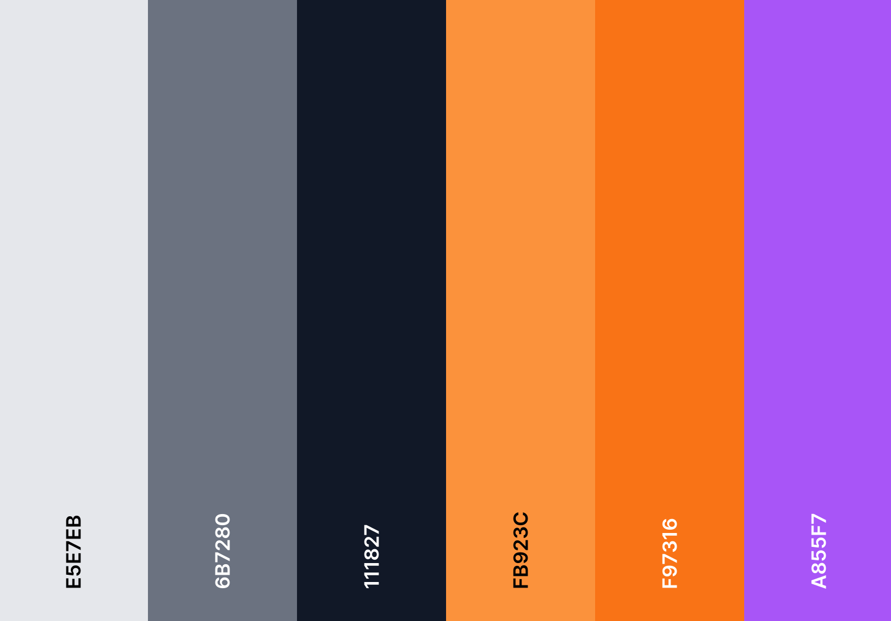

# Rhythmix: Sync your soul. Rhythms take control!

A music streaming web app where simplicity, sleek UI, and effortless usability converge in perfect harmony.
<br />

<div style="display: flex; justify-content: start; align-items: center; column-gap: 20px">
    
    
</div>


Powered by [Next.js v13.4](https://nextjs.org/) & [Supabase](https://supabase.com/)

### Exciting Features:

- **Uploads from User:** Share favorite songs effortlessly with a Rhythmix Pro subscription.
- **Secured Payments:** Set up secured recurring payments powered by Stripe.
- **Sleek Design:** Enjoy a visually appealing interface with smooth animations.
- **Anytime, Anywhere:** Fully responsive, seamlessly use the app on any device, any size.
- **Easy and Secure Authentication:** Hassle-free login with either email-password or Google & GitHub oauth providers.
- **Cancel Anytime:** Cancel your subscription anytime with a single click.
- **Cheap and Affordable:** Enjoy a premium experience at just ₹99 a month.
- **Simple Controls:** Play, pause, seek and skip songs with ease. Also has volume control.
- **Liked Songs:** Like songs with a single click and access them anytime as a playlist.


<hr />

## This section is developers only

## Getting Started

First, run the development server:

```bash
npm run dev
# or
yarn dev
# or
pnpm dev
```

Open [http://localhost:3000](http://localhost:3000) with your browser to see the result.

This project uses [`next/font`](https://nextjs.org/docs/basic-features/font-optimization) to automatically optimize and 
load ***Roboto*** and **Orbitron**, a custom Google Font.


## Colour Palette


